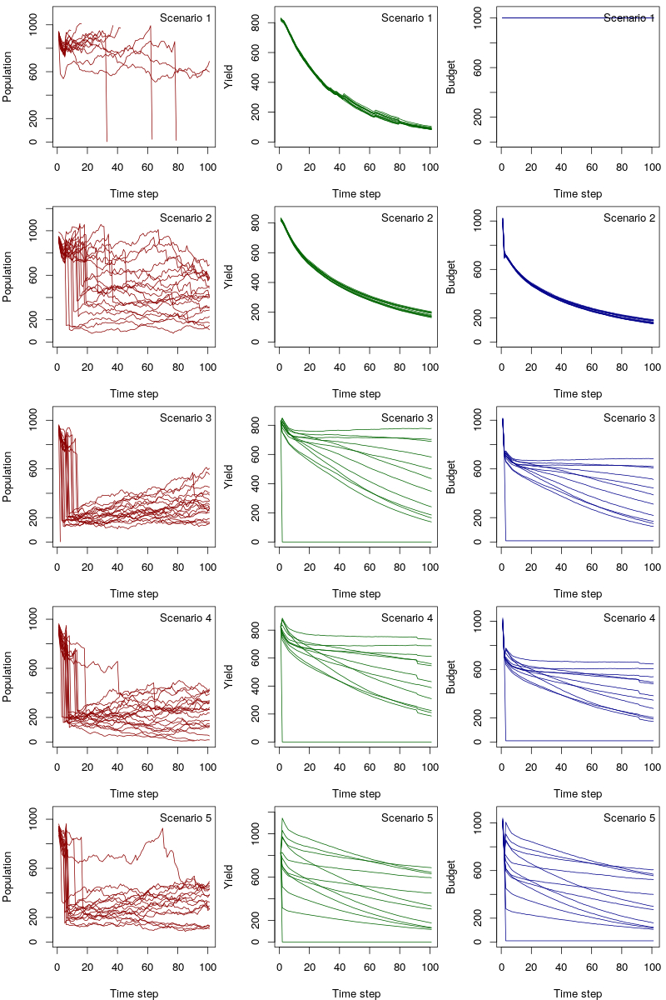
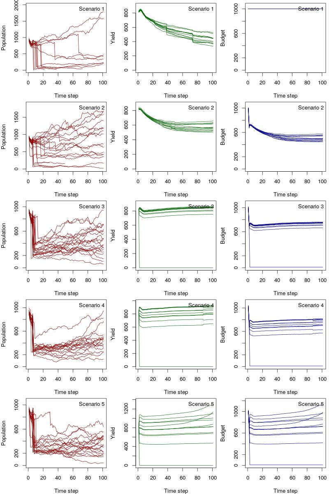
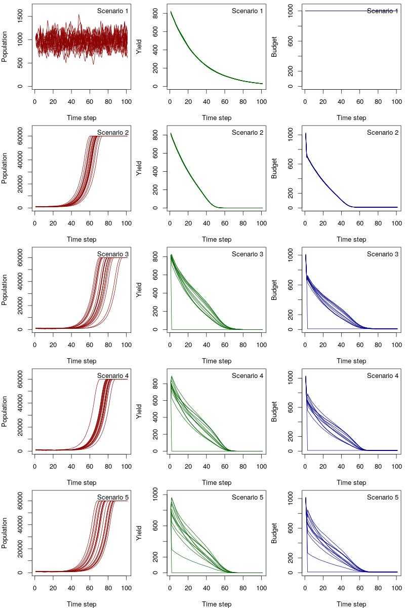
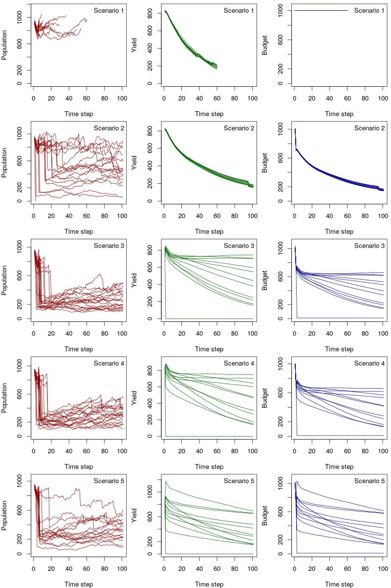

```{r setup, include=FALSE}
library(knitr)
library(kableExtra)
knitr::opts_chunk$set(echo = FALSE)
source("helpers.R")
source("gmse_apply_helpers.R")
source("gmse_vary_plotting.R")
```

## Tests of GMSE 0.4.0.13 vs 0.5.0.0

I here aim to run a number of simulations, using `gmse_apply()`, varying both user budget and user landownership. I
specifically compare the output of simulations run using the current CRAN version of GMSE (0.4.0.13) and the upcoming
GMSE 0.5.0.0.

## Scenario summaries

I compare five scenarios, summarised in the Table below.

| Scenario       | Land distribution    | User budget    | Manager budget    |
| :------------- | :------------------- | :------------  | :---------------  |
| Scenario 1     | Equal                | Constant       | = User budget     |
| Scenario 2     | Equal                | ~ yield        | ~ User budget     |
| Scenario 3     | $\sigma_{land}$ = 0.1| ~ yield        | ~ User budget     |
| Scenario 4     | $\sigma_{land}$ = 0.3| ~ yield        | ~ User budget     |
| Scenario 5     | $\sigma_{land}$ = 0.9| ~ yield        | ~ User budget     |

The first scenario replicates the "default" GMSE parameterisation,
where land is distributed evenly among stakeholders, and both user and manager budget are constant and equal. In the
second scenario, land distribution remains equal, but the user budget in each time step is a function of yield, and
manager budget in turn is a function of users' budgets (equal to a the sum of a fixed proportion of user budgets). In
scenarios 3-5, user and manager budgets are calculated in the same way as scenario 2, but in addition land ownership
varies between users, with variability increased from scenario 3-5 (details below).

In the output below, I have repeated the five scenarios three times. The first and second set are run using the current
GMSE version (0.4.0.13). The first set uses the default GMSE resource movement, i.e. randomly across the landscape. In
the second set, I have implemented an extra function which controls resource movement in between gmse_apply() calls
(details below, but in summary, in each time step, each resource moves to a cell with maximum yield within its movement
range). The third and final set of simulations uses the updated GMSE 0.5.0.0, using the newly available parameters
`consume_surv`, `consume_repr` and `times_feeding` to link resource reproduction and survival to consumption (setting `res_birth_type` = 0 and `res_death_type` = 0).

As plotted below, each scenario consists of 20 replicates of 100 time steps, with 12 stakeholders, a starting resource
population of 1000 individuals and a manager target population size of 1000 resource individuals. The simulated landscape consists of 100\times 100 cells, and users can kill resources, scare resources, or tend their crops.

Other parameters used
across all scenarios are listed in [Table 2](#common-parameters-across-simulations).

## (1) GMSE 0.4.0.13 & default resource movement {#section1}

The plots below summarise scenario results in terms of resource population trajectories (left hand column, in red), mean user yield across simulations (middle column, in green), and mean user budget (right hand column, in blue).

```{r fig.cap="Figure 1", out.width = '80%'}

```

## (2) GMSE 0.4.0.13 & **resource movement according to yield** {#section2}

This set of scenarios replicates the ones above but "turns off" default resource movement, instead using a custom function which moves each resource unit to a cell with maximum yield within its movement range, in each time step. As such, resource individuals will move to where yield (and thus budget in Scenarios 2-5) is highest. All other parameters are for the set of scenarios above.

```{r fig.cap="Figure 2", out.width = '80%'}

```

## (3) GMSE 0.5.0.0: with resource consumption/feeding parameters set

The next set of scenarios replicates the same set up but using GMSE release candidate 0.5.0.0.
This release has new movement parameters built in, linking resource reproduction and survival to consumption. Resource
movement itself remains random, so in that sense, if the end result on population dynamics is the same, we expect
comparable results to [Section 1](#section1) above.
New parameters are set as follows: `consume_surv` = 2 , `consume_repr` = 3 and `times_feeding` = 6, with `res_birth_type` = 0 and `res_death_type` = 0.

```{r fig.cap="Figure 3", out.width = '80%'}

```

From the perspective of custom `gmse_apply()` scenario runs in themselves completing as expected, with the new
parameters set, the above suggests there are no apparent issues with 0.5.0.0.
What is notable, is that even the "default" scenario produces quite different results with resource
survival/reproduction tied to consumption: population trajectories appear to be less volatile, producing an overall more
stable population level close to the manager target. In contrast, with added stakeholder variability in terms of budget
(Scenario 2) and land ownership (Scenarios 3-5), with the currently chosen values for `consume_surv`, `consume_repr`,
and `times_feeding`, it appears that populations are extremely fast-growing, quickly levelling to a maximum, with user
yield and budget approaching zero. This may simply be a consequences of the consumption/feeding parameters chosen, and a
key comparsion here would be with a further set of scenarios setting these to the defaults and implementing
res_birth_type and res_death_type; this should produce the same patterns as those shown in [Section 1](#section1).

## (4) GMSE 0.5.0.0: resource/consumption parameters at defaults

The last set of scenarios again uses the new candidate version of GMSE, but this time with the consumption parameters
kept a at the defaults and with `res_birth_type` = 2 and `res_death_type` = 3.
As expected, the resulting patterns are comparable to those in [Section 1](#section1), indicating that when ignoring the new resource
consumption parameters, GMSE 0.4.0.13 and GMSE 0.5.0.0 appear to produce the same results.

```{r fig.cap="Figure 4", out.width = '80%'}

```

## Common parameters across simulations

```{r}
source("build_para_grid.R")
tab = t(gmse_paras)
tab = cbind(row.names(tab),tab)
tab = as.data.frame(tab)
row.names(tab) = NULL
names(tab) = c("Parameter", "Value")
tab$Value = as.vector(tab$Value)
tab$Parameter = as.vector(tab$Parameter)

tab[tab$Parameter=="res_death_type","Parameter"] = 
  paste0(tab[tab$Parameter=="res_death_type","Parameter"],footnote_marker_alphabet(1))
tab[tab$Parameter=="lambda","Parameter"] = 
  paste0(tab[tab$Parameter=="lambda","Parameter"],footnote_marker_alphabet(1))
tab[tab$Parameter=="res_death_K","Parameter"] = 
  paste0(tab[tab$Parameter=="res_death_K","Parameter"],footnote_marker_alphabet(1))

tab[tab$Parameter=="manager_budget","Parameter"] = 
  paste0(tab[tab$Parameter=="manager_budget","Parameter"],footnote_marker_alphabet(2))
tab[tab$Parameter=="user_budget","Parameter"] = 
  paste0(tab[tab$Parameter=="user_budget","Parameter"],footnote_marker_alphabet(2))

tab[tab$Parameter=="res_move_to_yield","Parameter"] = 
  paste0(tab[tab$Parameter=="res_move_to_yield","Parameter"],footnote_marker_alphabet(3))

tab[tab$Parameter=="man_bud_prop","Parameter"] = 
  paste0(tab[tab$Parameter=="man_bud_prop","Parameter"],footnote_marker_alphabet(4))

tab[tab$Parameter=="yield_type","Parameter"] = 
  paste0(tab[tab$Parameter=="yield_type","Parameter"],footnote_marker_alphabet(5))

tab[tab$Parameter=="yield_value","Parameter"] = 
  paste0(tab[tab$Parameter=="yield_value","Parameter"],footnote_marker_alphabet(6))

kable(tab, escape = F) %>%
  kable_styling(bootstrap_options = "striped", full_width = F, position = "left") %>%
  footnote(alphabet = c("Population parameters overridden when resource consumption parameters are set (Section 3); ", 
                        "User and manager budgets overridden in Scenarios 2-5, where user budget is a function of yield, and                            manager budget is a function of user budgets; ",
                        "Parameter controlling whether resource movement takes places according to yield, only used in                                  Scenarios presented in Section 2",
                        "Parameter controlling the size of the managers' budget relative to user budgets; only used in                                  Scenarios 2-5. Manager budget in each time step equals the sum of man_bud_prop * each user's budget.",
                        "Parameter controlling the type of relationship between a user's yield and their budget in each time                              step; only applies in Scenarios 2-5. For the simualtions presented here, always a simple linear                                relationship.",
                        "Parameter controlling the strength of the relationship between a user's budget and their yield. A                              value of 0.8 would indicate that budget = 0.8*yield."
                        )
           )
```
