```{r setup, include=FALSE}
knitr::opts_chunk$set(echo = TRUE)
#source("land_dist_plot.R")
```
class:title-slide

.header[
.font150[**Predicting the effect of stakeholder variability in natural resource management: using the GMSE R package**]
]
<br>
<div class="row">
  <div class="column"; style="width: 100%; text-align: center">
    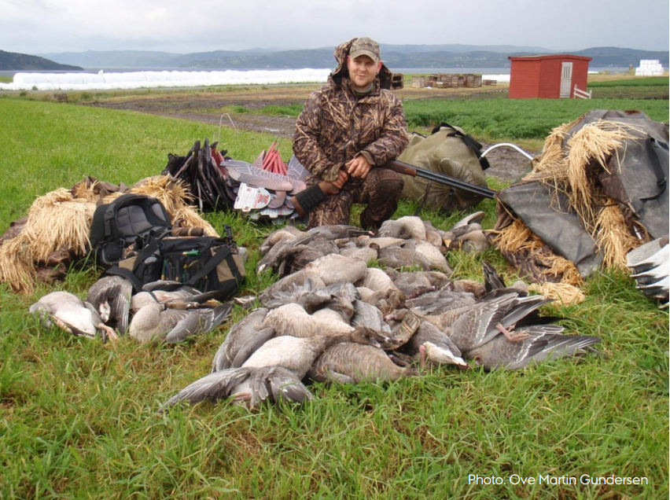
    
    
    
    <br>
  </div>
  <br>
  
  <div class="column"; style="width: 10%; float: left">
  <br>
  </div>
  <div class="column"; style="width: 50%; float: left; align-items:center; justify-content:center;">
    
    
    
  </div>
  <div class="column"; style="width: 30%; float: right; text-align: left">
    <b>Dr Jeroen Minderman</b><br>
    <a href="mailto:jeroen.minderman2@stir.ac.uk"><i>(jeroen.minderman2@stir.ac.uk)</i></a><br>
    Dr Brad Duthie<br>
    Prof Nils Bunnefeld<br>
  </div>
  <div class="column"; style="width: 10%; float: right; text-align: left; padding-left: 20px; padding-right: 20px">
    <br>
  </div>
  
</div>

???

Hello everyone and thank you very much for the opportunity to present this work. What I will be talking about here is
part of the work that is ongoing in the ConFooBio group at Stirling University. I should stress that the results I'll be
presenting are still very much a work in progress.
What's more - this is very much a collaborative project - in particular, I should make mention of Brad Duthie who has
been responsible for the development of the modelling platform I am using here.

---
# Introduction: .font90[*Increasing populations, increasing pressures*]...

.pull-left[

<div style="text-align: right"> 
.font120[ [Living Planet Index (2018)](http://www.livingplanetindex.org/projects?main_page_project=LivingPlanetReport&home_flag=1) ]
</div>
<div style="text-align: right"> 
```{r, out.width = "70%", fig.retina = 2, echo=FALSE}
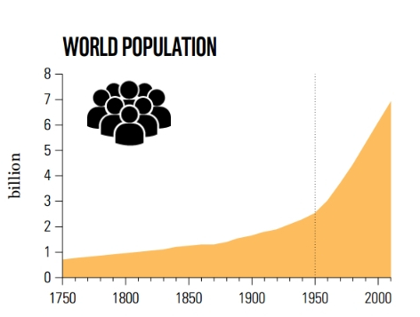
```
```{r, out.width = "70%", fig.retina = 2, echo=FALSE}
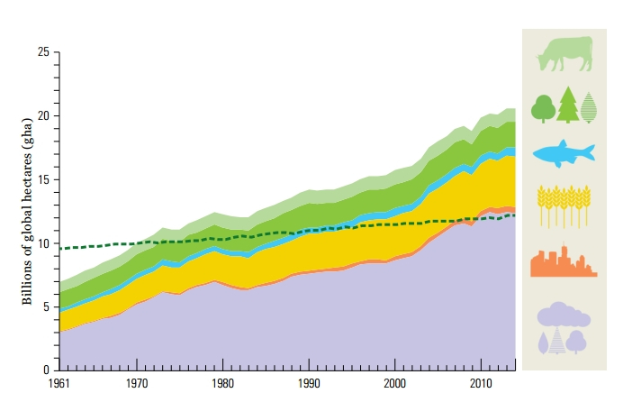
```  
</div>  

]

.pull-right[
  
```{r, out.width = "65%", fig.retina = 2, echo=FALSE}
knitr::include_graphics("https://live.staticflickr.com/8622/16470271775_9127343827_z.jpg")
```

```{r, out.width = "65%", fig.retina = 2, echo=FALSE}

```
]

???

It should be no news to anyone in this room that with rapidly increasing world populations - the image here on the left
is from the recent Living Planet Index report - anthropogenic pressures on the planet are also increasing rapidly. In
particular, exploitation of natural resources is a significant component of this. This could of course take the form
of extraction of resources such as timber, it also includes concurrent growth demand for food production through
agriculture, harvesting of animal populations, and also control of animal populations that may hinder crop productions.
In other words, the extent of conflicts between human interest in natural resources, and the conservation of animal
populations is growing.

---

# Introduction: .font90[*Management Strategy Evaluation*]

.left-column75[
<div style="text-align: center"> 
```{r, out.width = "80%", fig.retina = 2, echo=FALSE}
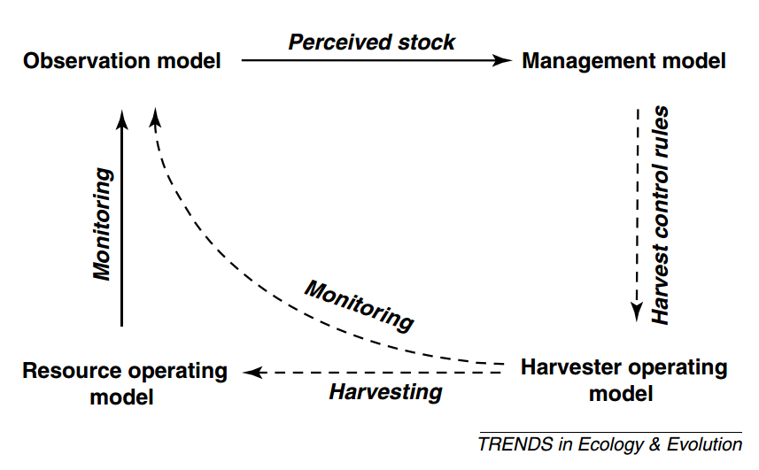
```   

.font120[
  
  From [Bunnefeld *et al*. (2011)](dx.doi.org/10.1016/j.tree.2011.05.003)]
</div>
]

.right-column25[

```{r, out.width = "100%", fig.retina = 2, echo=FALSE}
knitr::include_graphics("https://live.staticflickr.com/4842/45580281184_6adf8b370c_k.jpg")
```
```{r, out.width = "100%", fig.retina = 2, echo=FALSE}

```
]

???

As a consequence of such conflicts, the need for, and interest in, effective management of socio-economic systems has
increased in recent years. Management strategy evaluation approaches are conceptual frameworks for modelling dynamics of systems where stakeholders - both resource users and managers - interact with a resource population.
I don't intend to go into much detail about these in general here, but suffice to
say that they have their origins in fisheries management, but in recent years they have been applied to to non-fisheries systems, such as terrestrial herbivores, for example.

---

# Introduction: .font90[*.. however, variation matters*]

.pull-left[
<div style="text-align: right"> 
```{r, out.width = "60%", fig.retina = 2, echo=FALSE}
knitr::include_graphics("https://live.staticflickr.com/6007/5969571025_883acf26fd_k.jpg")
```
   
```{r, out.width = "60%", fig.retina = 2, echo=FALSE}
knitr::include_graphics("https://live.staticflickr.com/28/54237852_9983ba6d5f_k.jpg")
```
</div>
]

.pull-right[
<div style="text-align: left"> 
```{r, out.width = "75%", fig.retina = 2, echo=FALSE}
knitr::include_graphics("https://live.staticflickr.com/8652/15147528554_031c034c65_4k.jpg")
```

```{r, out.width = "75%", fig.retina = 2, echo=FALSE}
knitr::include_graphics("https://live.staticflickr.com/1505/24607172362_0a95f68a1e_4k.jpg")
```
</div>
]

<div style="text-align: center"> 
.font120[.. but most MSE approaches do not (cannot) account for this]
</div>

???

However, what almost such frameworks are lacking, are easy ways to take account of, and include variability among
stakeholders. 
This is obviously important on many different spatial scales - individual farmers or farms for example often have highly variable financial means - property sizes, budgets, or even extent of possible farming activities will vary. 
Although it is intuitively clear that such variation will affect the extent to which such stakeholders affect natural
resources, most implementations of MSE cannot account for this.

---

# Introduction: .font90[*.. and equity may be related to biodiversity loss*]

.pull-left[
<div style="text-align: right"> 
```{r, out.width = "80%", fig.retina = 2, echo=FALSE}
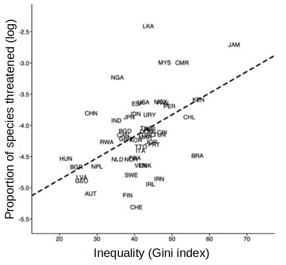
```
</div>
<div style="text-align: center"> 
.font110[Holland *et al*. (2009)<br>**A Cross-National Analysis of How Economic Inequality Predicts Biodiversity Loss**<br>[Cons Biol 23(5)]( https://onlinelibrary.wiley.com/doi/pdf/10.1111/j.1523-1739.2009.01207.x)]
</div>
]

.pull-right[
```{r, out.width = "90%", fig.retina = 2, echo=FALSE}
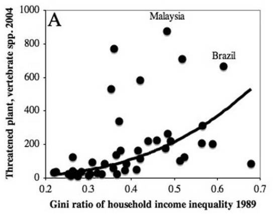
```
<div style="text-align: center"> 
.font110[Mikkelson *et al*. (2007)<br>**Economic Inequality Predicts Biodiversity Loss**<br>[PLoS ONE 2(5): e444]( https://doi.org/10.1371/journal.pone.0000444]
</div>
)
]

???

This is potentially an important shortcoming, because from previous studies we know that socio-political variation can
affect biodiversity conservation.
On a global level, for example, these two different studies by Holland et al and Mikkelson et al. both show the effect
of country-level differences in measures of economic inequality (here measured as the Gini-index) on species threat
status. Specifically, as economic inequality increases, both analyses suggest that a greater number of species are at
greater risk of extinction.
In some ways, this is a fairly intuitive result - it is relatively easy to imagine that greater levels of economic
inequality will lead to increased difficulties in managing threatened species effectively.

---

# Aims

.left-column25[
```{r, out.width = "75%", fig.retina = 2, echo=FALSE}
knitr::include_graphics("https://jejoenje.shinyapps.io/ggmse1/_w_bc0eeeab/GMSE_logo_name.png")
```   

```{r, out.width = "75%", fig.retina = 2, echo=FALSE}
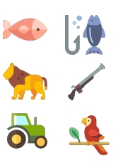
```   
]

.right-column75[

.font120[
1. **Introduce GMSE** as flexible and extensible platform for simulating population management  
  
  .font90[Brief overview of methods, capabilities, etc...]

2. Use GMSE to **test effect of stakeholder variation** on population management. 

  .font90[Does inequity in wealth and land ownership affect extinction risk?]


]

]

???

So, that brings me to the aims of the current talk.
They are two-fold.
First, I intend to introduce GMSE, or Generalised MSE. This is a highly flexible and extensible modelling framework for
MSE, which was developed over the last few years in the ConFooBio group at Stirling University. I will give a very quick overview of its methodologies and potential.
Secondly, I will then try to kill two birds with one stone, and demonstrate the utility and capabilities of GMSE by
using it to test the effect of variation in stakeholder properties on the resulting population management. Specifically,
does variation in wealth and land ownership affect extinction risk of the species under management?

---
# Generalised Management Strategy Evaluation (1)

.pull-left[
```{r, out.width = "100%", fig.retina = 2, echo=FALSE}
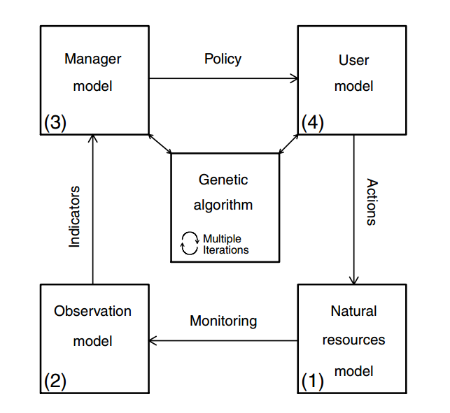
```   

]

.pull-right[
```{r, out.width = "45%", fig.retina = 2, echo=FALSE, fig.align = "left"}

```   
  
Duthie et al. (2018) *Methods in Ecology & Evolution*. **[DOI: 10.1111/2041-210X.13091](http://doi.wiley.com/10.1111/2041-210X.13091)**

- Individual-based & spatially explicit
- **"Manager"**: .red[**maintain resource**]
- **"Users"**: .red[**maximise yield**]  
  .font90[("resource" may negatively affect yield)]
- "Users" can choose to e.g. farm, kill resources, etc.
- Cost of each action set by manager
  
- Available as an [**R package**](https://cran.r-project.org/web/packages/GMSE/index.html) 

]

???

So, GMSE - a very brief introduction to GMSE. Unfortunately I'll have very little time to get into all of the details,
but if you are interested, a good starting point is the paper I've linked to here, through which you will be able to
find a large collection of examples and background material.
As said, GMSE is a specific implementation of a MSE framework. As such, it follows the rough outline we have
already seen, and consists of four main component models. The natural resource is modelled, which is observed through an
observation model, feeds into a manager model, and then into a user model. Users' decision affect the resource, after
which the cycle starts again.
In GMSE, each of these four models are entirely customisable, but by default they are individually-based and spatially explicit. 
In the default set up, it is easiest to conceptualise this framework as users being farmers which aim to maximise yield
from their crop, and  the manager being a government setting a target resource population which they are trying to
maintain. The resource population would be animals which can damage crop yield.

Actions taken by users may or may not affect the resource population - examples are farming, killing resources or
scaring resources (which moves the resource away from a farmers' land).
Each of the users' actions have a cost, which they have to pay from their budget. 
Costs for each action are set by the manager. The manager chooses a cost for each of the users' action, according to
their own budget, the managers target level of the resource population, and the distance between this target and the
current population level.
As said, I don't have time to go into much detail here, but GMSE is available as an R package with extensive
documentation, including many examples.

---

# Simulation scenarios

.pull-left[
## General set-up
<div style="text-align: center">
```{r, out.width = "40%", fig.retina = 2, echo=FALSE, fig.align = "centre"}
knitr::include_graphics("https://live.staticflickr.com/255/19760068178_8ce2ccf7e8_k.jpg")
```
```{r, out.width = "40%", fig.retina = 2, echo=FALSE, fig.align = "centre"}
knitr::include_graphics("https://live.staticflickr.com/2215/1516678360_d34081e144_k.jpg")
```
</div>

- Resource population exploits crops (i.e. negatively affects users' yield)  
- Users can farm, kill resources on their land, or "scare" resources off their land  
- All land is "privately" owned; users can only kill on their own land  
]

.pull-right[
## Stakeholder variation

- Budgets ~ yield
- Land distribution varied:

```{r, out.width = "75%", fig.retina = 2, echo=FALSE, fig.align = "centre"}
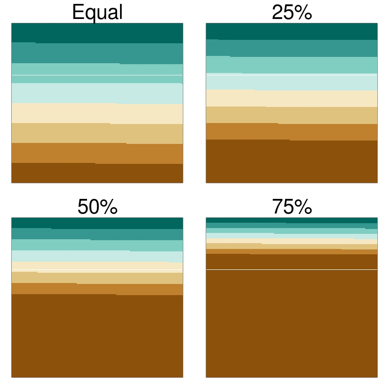
```   


]

???

Instead, what I will do here, is provide you with a specific example of using GMSE to explore the effect of variation
among stakeholders.
As a general set up, I will be simulating a resource population of animals which is under management but also damages
the crop yield by farmers. I should stress that in this case, this should be viewed as an entirely hypothetical animal
population, and I haven't parameterised this for any specific examples, but think for example of a managed population of
herbivores such as geese.
I model a total of 8 stakeholders - or "users" in GMSE terminology - who own various bits of the landscape. In each
model time step, these users can take one of three actions - either farm their land to increase crop yield, shoot a
number of resource animals to lower the damage they cause, or they can scare the animals off their land.
In this scenario, the users (farmers) can only affect resources which are on their own land.
The managers' target population size is 1000 animals of the resource.

In addition to this basic GMSE set up, I have here introduced variation among stakeholders.
Specifically, the users' budget in each time step is a function of the yield they achieve; for simplicity, here I
have implemented this as a simple linear function with a little bit of variation around it.
In addition to this, I vary land distribution in four different scenarios - one following the default GMSE land
distribution, where each user simply has an equal share of the landscape, and three where the land distribution is
increasingly uneven - from 25% of the landscape belonging to a single user, to 50% to 75%. [In these images, the
landscape is represented by a square and each colour is the land owned by the different farmers.]
This variation in land ownership will obviously have consequences for both potential yield, but also potential effect on
the resource population.
As a final note, I should stress that in this toy example, the animals distribute themselves randomly across the
landscape in each time step, and the manager's budget is fixed to the mean of the users' budget in each scenario.

Given this parameter selection, I have simulated 100 time steps (100 years) of this socio-ecological system, and
repeated this for 100 replicates.

---

# Results (1)

## Increasing inequality = .red[***decreases***] extinction risk??

.pull-left[
```{r, out.width = "100%", fig.retina = 2, echo=FALSE, fig.align = "centre"}
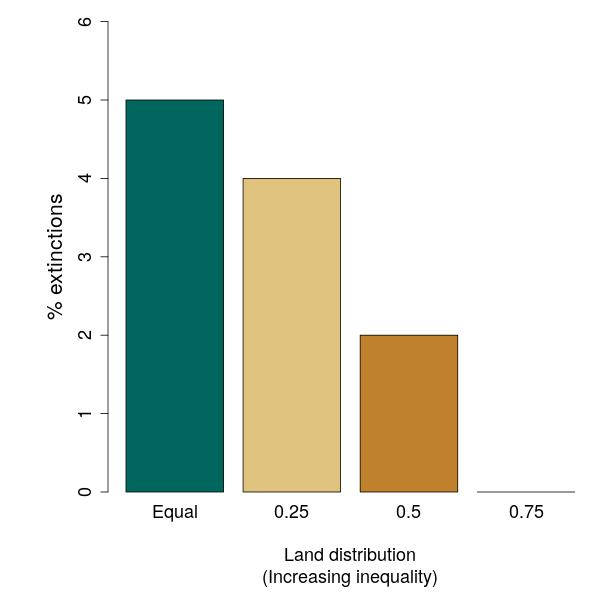
```   
]

.pull-right[
```{r, out.width = "100%", fig.retina = 2, echo=FALSE, fig.align = "centre"}
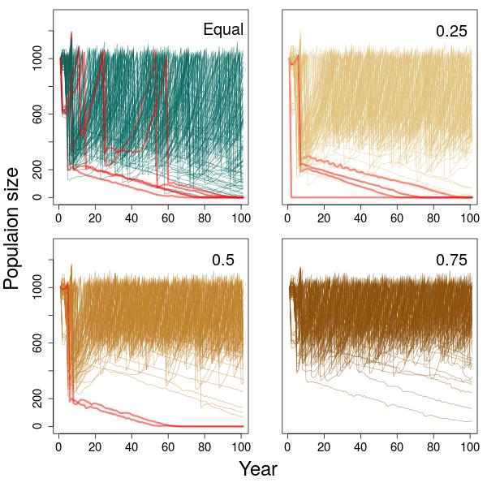
```   
]

???

So, much to my surprise, the initial results of this simulation appeared to be rather counter-intuitive. Instead of
extinction risk increasing with increasing levels of stakeholder inequality in land distribution, it appears that the
opposite is true.
In this figure on the left, I have simply summarised the percentage of extinctions that occured in each land
distribution scenario - as you can see, extinction is more frequent when the land is distribution - and thus user budget
- is equal, compared the the more inequitable land distributions, and decreases to 0 when the land is distributed most
unevenly.
The same pattern is of course also reflected in the population trajectories themselves, which you can see in the panels
on  the right here, where each line is the population size in a single simulation, with cases where the population went
extinct highlighted in red. 
Note that not only are extinctions more frequent as land distribution becomes more equal, the overall trends are more
steeply negative as well.

---

# Results (2)

## Increasing inequality = .red[**budgets severely limited**] for some..

.pull-left[
```{r, out.width = "100%", fig.retina = 3, echo=FALSE, fig.align = "centre"}

```   
]

.pull-right[
```{r, out.width = "100%", fig.retina = 3, echo=FALSE, fig.align = "centre"}
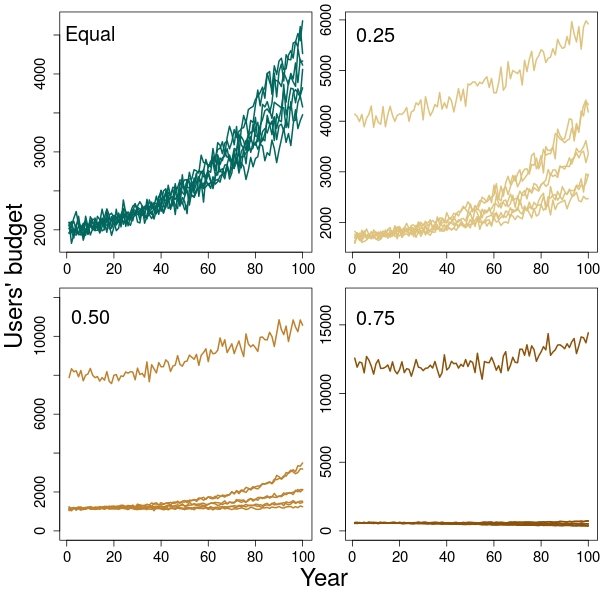
```   
]

???

Given what I was talking about earlier and the previous empirical evidence this is a rather surprising result, so why is
this going on?
It is informative to actually start looking at what is going on with both the individual farmers' budgets, as well as
the spatial distribution of the animal populations.
Let's start with the users (or farmers') budgets - I've here plotted the mean budget for each of the eight users across
all 100 simulations, for each of the land distribution scenarios.
It should be immediately obvious that, as well as increasing budgets over time, because users' budget is a function of
their yield, as inequality in land distribution increases, so does the gap in wealth between a single larger land owner,
and a bigger number of smaller land owners.
Because a users' ability to take certain actions (such as kill or scare resources off their land) is dependent on their
budget, what this in turn means, is that in the more unequal scenarios, the power of the users' becomes biased towards
the bigger land owner.

---

# Results (3)

## Limited budgets, .red[**limited power = *de facto* population refuges**]

.left-column[
  <div class="row"; style="text-align: center; color: black">
    <br>
    <br>
    <b>Unequal</b> distribution (75%)
  </div>
  <div class="row"; style="text-align: center; color: black">
    <br><br><br><br><br>
    <b>Equal</b> distribution
  </div>
]

.right-column[
```{r, out.width = "60%", fig.retina = 3, echo=FALSE, fig.align = "centre"}
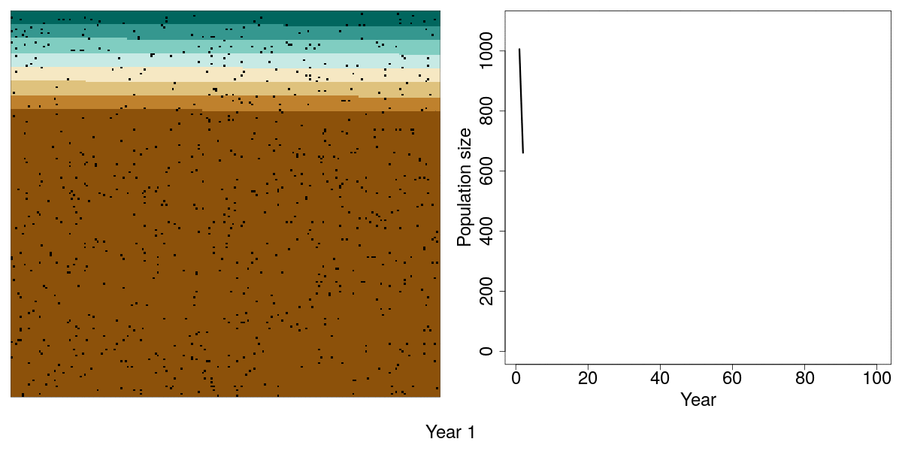
```   
```{r, out.width = "60%", fig.retina = 3, echo=FALSE, fig.align = "centre"}
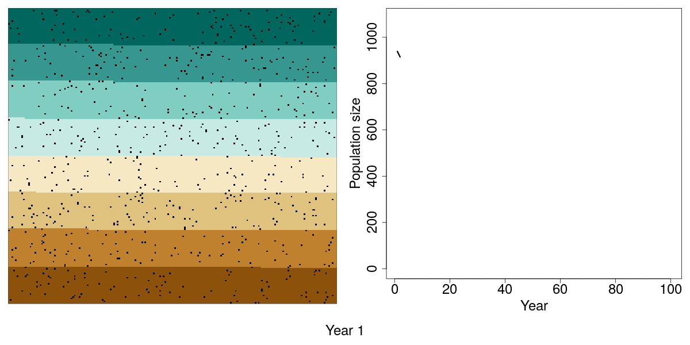
```   
]

???

Knowing this, the observed decrease in extinction risk with increasing socio-economic inequality may become more
understandable, particularly when also considering the effect on spatial distribution of the animal population.
In this pair of plots, I've produced the position of each individual animal on the landscape throughout two of the
simulated scenarios - the most unequal land distribution at the top, and the even land distribution in the bottom. The
graphs on the right just shows the resulting population trajectory in a single simulation example
As you can see, what actually happens in the case of highly unequal land ownership, the single "rich" landowner has
sufficient ability to simply kill and scare resources off their land, which results in a progressive shift of the animal
distribution into the small landholders' lands. These landowners in turn have such a limited budget in the first place
(because the yield from their land is small), they have very little ability to affect the population. In effect, the
poorer landholders' land becomes a de facto population refuge, allowing the population to maintain a reasonable
level.

By contrast, when looking at the population distribution and concurrent population trajectories in the equal land
distribution scenario, all users have equal budget and thus equal ability to affect the population - by virtue of the
equal land distribution, the population is also equally exposed to each land owner. As a result, the population takes
bigger hits and is thus under greater risk of extinction overall.

---

# Conclusions & discussion

.pull-left[
<div style="text-align: center"> 
```{r, out.width = "50%", fig.retina = 2, echo=FALSE, fig.align = "centre"}

```  
<br>
```{r, out.width = "40%", fig.retina = 2, echo=FALSE}

```
```{r, out.width = "40%", fig.retina = 2, echo=FALSE}

```
</div>
]

.pull-right[
### <b>Counterintuitive?</b>

- Current model clearly "toy" example...
- Equality - biodiversity relation is complex.
- Models need ability to account for this!
- Many factors affect equality:biodiversity relationship.

<p>

- GMSE highly flexible; 
- Can be extended as needed, e.g. 
  - More realistic yield function
  - Resource selection functions
  - Further complex land distribution..
  - ...

]

???

Having said all of this, to conclude, it is still counterintuitive to say that increasing inequality is going to be
associated wih lower extinction risk.
Obviously I should stress that the simulations I have shown here are just a simple toy example, with many parameters and
aspects of real systems not modelled.
Having said that, I strongly believe that what this simple modelling excercise does show, is the need to be careful
about taking apparently intuitive patterns for granted, and the need to account for complexity in socio-economic
systems. Many factors will affect the apparent relationships between social equity and biodiversity, and to make
effective predictions, we need to be able to account for this in our models.
However, I hope that I have convinced you that using GMSE it will be possible to start adding the necessary complexity
to these models quite quickly.
Specifically, it will be relatively straightforward to start adding, for example, more realistic yield return functions,
perhaps even ones that vary by stakeholder.
As another example specific to the simualtions I have just shown, GMSE would be able to account for redistribution of
land as a result of farmers going bust; so it will be possible to start looking at effects of societal change on
population management. Given the flexible GMSE framework, the possibilities are really endless.

---

# Thank you!

.pull-left[

<div style="float: left; width: 45%;">
```{r, out.width = "100%", fig.retina = 2, echo=FALSE, fig.align='center'}
knitr::include_graphics("https://sticsdotorg.files.wordpress.com/2016/03/photo1.jpeg")
```
<div style="text-align: center">
<a href="https://www.stir.ac.uk/people/257162"><b>Nils Bunnefeld</b></a>
</div>
</div>
<div style="float: right; width: 45%;">
```{r, out.width = "80%", fig.retina = 2, echo=FALSE, fig.align='center'}
knitr::include_graphics("https://sticsdotorg.files.wordpress.com/2016/03/self_sq.jpg?w=277&h=278")
```   
<div style="text-align: center">
<a href="http://bradduthie.github.io/"><b>Brad Duthie</b></a>
</div>
</div><br>
<div style="float: left; width: 45%; text-align: center;">
</div><br>
<div style="float: right; width: 45%; text-align: center;">
</div>
<p>
<br><br><br><br>
<div style="text-align: center">
<a href="https://www.stir.ac.uk/people/256882">Jeremy Cusack</a><br>
<a href="https://www.stir.ac.uk/people/257356">Lynsey Bunnefeld</a><br>
<a href="https://www.stir.ac.uk/people/257474">Sarobidy Rakotonarivo</a><br>  
<a href="https://www.stir.ac.uk/people/256518">Isabel Jones</a><br>  
<a href="https://wherethewildthingslive.co.uk/about-the-author/">Isla Hodgson</a><br>
<a href="https://sti-cs.org/rocio-pozo/">Rocio Pozo</a><br>
<a href="https://sti-cs.org/lovisa-nilsson/">Lovisa Nilsson</a>
<p>
```{r, out.width = "25%", fig.retina = 2, echo=FALSE}
knitr::include_graphics("https://www.stir.ac.uk/webcomponents/dist/css/images/logos/logo.svg")
```
</div>
]

.pull-right[
<div style="text-align: center">
```{r, out.width = "50%", fig.retina = 2, echo=FALSE, fig.align='center'}
knitr::include_graphics("https://sticsdotorg.files.wordpress.com/2016/03/confoobio-stacked-logo.png?w=300&h=300")
```
<br>
```{r, out.width = "40%", fig.retina = 2, echo=FALSE, fig.align='center'}
knitr::include_graphics("https://sticsdotorg.files.wordpress.com/2019/06/image.png?w=960")
```   

]

???

So I hope this has given you some idea of what this modelling framework can do.
I just wanted to specifically say thanks to these two gentlemen here, without whom I probably wouldn't be talking to you
about this today. Thanks very much for your attention.

---
