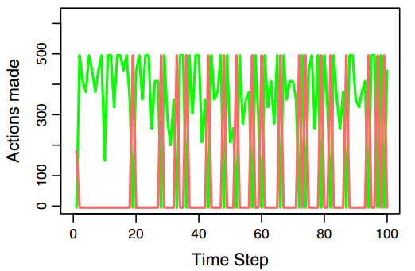
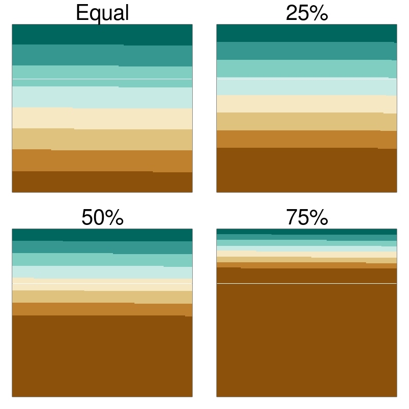

```{r setup, include=FALSE}
knitr::opts_chunk$set(echo = TRUE)
#source("land_dist_plot.R")
```
class:title-slide

.header[
.font150[**Predicting the effect of stakeholder variability in natural resource management: using the GMSE R package**]
]
<br>
<div class="row">
  <div class="column"; style="width: 100%; text-align: center">
    
    
    
    
    <br>
  </div>
  <br>
  
  <div class="column"; style="width: 10%; float: left">
  <br>
  </div>
  <div class="column"; style="width: 50%; float: left; align-items:center; justify-content:center;">
    
    
    
  </div>
  <div class="column"; style="width: 30%; float: right; text-align: left">
    <b>Dr Jeroen Minderman</b><br>
    <a href="mailto:jeroen.minderman2@stir.ac.uk"><i>(jeroen.minderman2@stir.ac.uk)</i></a><br>
    Dr Brad Duthie<br>
    Prof Nils Bunnefeld<br>
  </div>
  <div class="column"; style="width: 10%; float: right; text-align: left; padding-left: 20px; padding-right: 20px">
    <br>
  </div>
  
</div>


---
# Introduction: .font90[*Increasing populations, increasing pressures*]...

.pull-left[

<div style="text-align: right"> 
.font120[ [Living Planet Index (2018)](http://www.livingplanetindex.org/projects?main_page_project=LivingPlanetReport&home_flag=1) ]
</div>
<div style="text-align: right"> 
```{r, out.width = "70%", fig.retina = 2, echo=FALSE}
knitr::include_graphics("pics/Worldpop_LPI_icons.jpg")
```
```{r, out.width = "70%", fig.retina = 2, echo=FALSE}

```  
</div>  

]

.pull-right[
  
```{r, out.width = "65%", fig.retina = 2, echo=FALSE}
knitr::include_graphics("https://live.staticflickr.com/8622/16470271775_9127343827_z.jpg")
```

```{r, out.width = "65%", fig.retina = 2, echo=FALSE}
knitr::include_graphics("pics/goosehunter.jpg")
```
]
  
---

# Introduction: .font90[*Management Strategy Evaluation*]

.left-column75[
<div style="text-align: center"> 
```{r, out.width = "80%", fig.retina = 2, echo=FALSE}
knitr::include_graphics("pics/MSE1.png")
```   

.font120[
  
  From [Bunnefeld *et al*. (2011)](dx.doi.org/10.1016/j.tree.2011.05.003)]
</div>
]

.right-column25[
```{r, out.width = "100%", fig.retina = 2, echo=FALSE}
knitr::include_graphics("https://live.staticflickr.com/4842/45580281184_6adf8b370c_k.jpg")
```
]

---

# Introduction: .font90[*Management Strategy Evaluation*]

.left-column75[
<div style="text-align: center"> 
```{r, out.width = "80%", fig.retina = 2, echo=FALSE}
knitr::include_graphics("pics/MSE1.png")
```   

.font120[
  
  From [Bunnefeld *et al*. (2011)](dx.doi.org/10.1016/j.tree.2011.05.003)]
</div>
]

.right-column25[

```{r, out.width = "100%", fig.retina = 2, echo=FALSE}
knitr::include_graphics("https://live.staticflickr.com/4842/45580281184_6adf8b370c_k.jpg")
```
```{r, out.width = "100%", fig.retina = 2, echo=FALSE}
knitr::include_graphics("pics/goosehunter.jpg")
```
]

---

# Introduction: .font90[*.. however, variation matters*]

.pull-left[
<div style="text-align: right"> 
```{r, out.width = "60%", fig.retina = 2, echo=FALSE}
knitr::include_graphics("https://live.staticflickr.com/6007/5969571025_883acf26fd_k.jpg")
```
   
```{r, out.width = "60%", fig.retina = 2, echo=FALSE}
knitr::include_graphics("https://live.staticflickr.com/28/54237852_9983ba6d5f_k.jpg")
```
</div>
]
--

.pull-right[
<div style="text-align: left"> 
```{r, out.width = "75%", fig.retina = 2, echo=FALSE}
knitr::include_graphics("https://live.staticflickr.com/8652/15147528554_031c034c65_4k.jpg")
```

```{r, out.width = "75%", fig.retina = 2, echo=FALSE}
knitr::include_graphics("https://live.staticflickr.com/1505/24607172362_0a95f68a1e_4k.jpg")
```
</div>
]

<div style="text-align: center"> 
.font120[.. but most MSE approaches do not (cannot) account for this]
</div>

---

# Introduction: .font90[*.. and equity may be related to biodiversity loss*]

.pull-left[
<div style="text-align: right"> 
```{r, out.width = "80%", fig.retina = 2, echo=FALSE}
knitr::include_graphics("pics/Holland_Fig2.jpg")
```
</div>
<div style="text-align: center"> 
.font110[Holland *et al*. (2009)<br>**A Cross-National Analysis of How Economic Inequality Predicts Biodiversity Loss**<br>[Cons Biol 23(5)]( https://onlinelibrary.wiley.com/doi/pdf/10.1111/j.1523-1739.2009.01207.x)]
</div>
]

.pull-right[
```{r, out.width = "90%", fig.retina = 2, echo=FALSE}
knitr::include_graphics("pics/Mikkelson_Fig1a.png")
```
<div style="text-align: center"> 
.font110[Mikkelson *et al*. (2007)<br>**Economic Inequality Predicts Biodiversity Loss**<br>[PLoS ONE 2(5): e444]( https://doi.org/10.1371/journal.pone.0000444]
</div>
)
]

---

# Aims

.left-column25[
```{r, out.width = "75%", fig.retina = 2, echo=FALSE}
knitr::include_graphics("https://jejoenje.shinyapps.io/ggmse1/_w_bc0eeeab/GMSE_logo_name.png")
```   

```{r, out.width = "75%", fig.retina = 2, echo=FALSE}

```   
]

.right-column75[

.font120[
1. **Introduce GMSE** as flexible and extensible platform for simulating population management  
  
  .font90[Brief overview of methods, capabilities, etc...]

2. Use GMSE to **test effect of stakeholder variation** on population management. 

  .font90[Does inequity in wealth and land ownership affect extinction risk?]


]

]

---
# Generalised Management Strategy Evaluation (1)

.pull-left[
```{r, out.width = "100%", fig.retina = 2, echo=FALSE}
knitr::include_graphics("pics/gmse_main_chart.png")
```   

]

.pull-right[
```{r, out.width = "45%", fig.retina = 2, echo=FALSE, fig.align = "left"}
knitr::include_graphics("pics/GMSE_logo_name.jpg")
```   
  
Duthie et al. (2018) *Methods in Ecology & Evolution*. **[DOI: 10.1111/2041-210X.13091](http://doi.wiley.com/10.1111/2041-210X.13091)**

- Individual-based & spatially explicit
- **"Manager"**: .red[**maintain resource**]
- **"Users"**: .red[**maximise yield**]  
  .font90[("resource" may negatively affect yield)]
- "Users" can choose to e.g. farm, kill resources, etc.
- Cost of each action set by manager
  
- Available as an [**R package**](https://cran.r-project.org/web/packages/GMSE/index.html) 

]

---
# Generalised Management Strategy Evaluation (2)

.pull-left[
<div style="text-align: center">
```{r, out.width = "80%", fig.retina = 2, echo=FALSE}

```   
```{r, out.width = "80%", fig.retina = 2, echo=FALSE}

```   
</div>
]

.pull-right[
```{r, out.width = "45%", fig.retina = 2, echo=FALSE, fig.align = "left"}
knitr::include_graphics("pics/GMSE_logo_name.jpg")
```   
  
Duthie et al. (2018) *Methods in Ecology & Evolution*. **[DOI: 10.1111/2041-210X.13091](http://doi.wiley.com/10.1111/2041-210X.13091)**

- Individual-based & spatially explicit
- **"Manager"**: .red[**maintain resource**]
- **"Users"**: .red[**maximise yield**]  
  .font90[("resource" may negatively affect yield)]
- "Users" can choose to e.g. farm, kill resources, etc.
- Cost of each action set by manager
  
- Available as an [**R package**](https://cran.r-project.org/web/packages/GMSE/index.html) 
]

---

# Simulation scenarios

.pull-left[
## General set-up
<div style="text-align: center">
```{r, out.width = "40%", fig.retina = 2, echo=FALSE, fig.align = "centre"}
knitr::include_graphics("https://live.staticflickr.com/255/19760068178_8ce2ccf7e8_k.jpg")
```
```{r, out.width = "40%", fig.retina = 2, echo=FALSE, fig.align = "centre"}
knitr::include_graphics("https://live.staticflickr.com/2215/1516678360_d34081e144_k.jpg")
```
</div>

- Resource population exploits crops (i.e. negatively affects users' yield)  
- Users can farm, kill resources on their land, or "scare" resources off their land  
- All land is "privately" owned; users can only kill on their own land  
]
--

.pull-right[
## Stakeholder variation

- Budgets ~ yield
- Land distribution varied:

```{r, out.width = "75%", fig.retina = 2, echo=FALSE, fig.align = "centre"}

```   


]

---

# Results (1)

## Increasing inequality = .red[***decreases***] extinction risk??

.pull-left[
```{r, out.width = "100%", fig.retina = 2, echo=FALSE, fig.align = "centre"}

```   
]

.pull-right[
```{r, out.width = "100%", fig.retina = 2, echo=FALSE, fig.align = "centre"}
knitr::include_graphics("pics/pop_trends_1.jpg")
```   
]


---

# Results (2)

## Increasing inequality = .red[**budgets severely limited**] for some..

.pull-left[
```{r, out.width = "100%", fig.retina = 3, echo=FALSE, fig.align = "centre"}

```   
]

.pull-right[
```{r, out.width = "100%", fig.retina = 3, echo=FALSE, fig.align = "centre"}

```   
]

---

# Results (3)

## Limited budgets, limited power = *de facto* population refuges

.pull-left[
```{r, out.width = "100%", fig.retina = 3, echo=FALSE, fig.align = "centre"}

```   
]

.pull-right[
```{r, out.width = "100%", fig.retina = 3, echo=FALSE, fig.align = "centre"}

```   
]
---

# Results (4)

.pull-left[
```{r, out.width = "100%", fig.retina = 3, echo=FALSE, fig.align = "centre"}

```   
]

.pull-right[
```{r, out.width = "100%", fig.retina = 3, echo=FALSE, fig.align = "centre"}

```   
]

---

# Conclusions: .. so what?
--

.pull-left[
```{r, out.width = "65%", fig.retina = 2, echo=FALSE, fig.align = "right"}

```
<div style="text-align: right; font-size: 75%;">
<a href="https://www.theguardian.com/uk-news/2013/aug/10/scotland-land-rights">(The Observer, August 2013)</a>
</div>
```{r, out.width = "60%", fig.retina = 2, echo=FALSE, fig.align = "right"}
knitr::include_graphics("https://i.guim.co.uk/img/static/sys-images/Guardian/Pix/maps_and_graphs/2013/8/12/1376299018660/Scotland-map-blue2.png?width=620&quality=85&auto=format&fit=max&s=4d1449193ee171dedf186c49f80ae8ec")
``` 
]
--

.pull-right[
## ... and globally
```{r, out.width = "100%", fig.retina = 2, echo=FALSE, fig.align = "left"}

```
<div style="text-align: center; font-size: 75%;">
<a href="https://inequality.org/facts/global-inequality/">https://inequality.org/facts/global-inequality/</a>
</div>
]

---

# Conclusions & discussion

---

# Thank you!

.pull-left[

<div style="float: left; width: 45%;">
```{r, out.width = "100%", fig.retina = 2, echo=FALSE, fig.align='center'}
knitr::include_graphics("https://sticsdotorg.files.wordpress.com/2016/03/photo1.jpeg")
```
<div style="text-align: center">
<a href="https://www.stir.ac.uk/people/257162"><b>Nils Bunnefeld</b></a>
</div>
</div>
<div style="float: right; width: 45%;">
```{r, out.width = "80%", fig.retina = 2, echo=FALSE, fig.align='center'}
knitr::include_graphics("https://sticsdotorg.files.wordpress.com/2016/03/self_sq.jpg?w=277&h=278")
```   
<div style="text-align: center">
<a href="http://bradduthie.github.io/"><b>Brad Duthie</b></a>
</div>
</div><br>
<div style="float: left; width: 45%; text-align: center;">
</div><br>
<div style="float: right; width: 45%; text-align: center;">
</div>

<br><br><br><br><p>
<div style="text-align: center">
<a href="https://www.stir.ac.uk/people/256882">Jeremy Cusack</a><br>
<a href="https://www.stir.ac.uk/people/257356">Lynsey Bunnefeld</a><br>
<a href="https://www.stir.ac.uk/people/257474">Sarobidy Rakotonarivo</a><br>  
<a href="https://sti-cs.org/rocio-pozo/">Rocio Pozo</a><br>
<a href="https://www.stir.ac.uk/people/256518">Isabel Jones</a><br>  
<a href="https://wherethewildthingslive.co.uk/about-the-author/">Isla Hodgson</a><br><br>
```{r, out.width = "40%", fig.retina = 2, echo=FALSE}
knitr::include_graphics("https://www.stir.ac.uk/webcomponents/dist/css/images/logos/logo.svg")
```
</div>
]

.pull-right[
<div style="text-align: center">
```{r, out.width = "50%", fig.retina = 2, echo=FALSE, fig.align='center'}
knitr::include_graphics("https://sticsdotorg.files.wordpress.com/2016/03/confoobio-stacked-logo.png?w=300&h=300")
```
<br>
```{r, out.width = "40%", fig.retina = 2, echo=FALSE, fig.align='center'}
knitr::include_graphics("https://sticsdotorg.files.wordpress.com/2019/06/image.png?w=960")
```   

]


---
